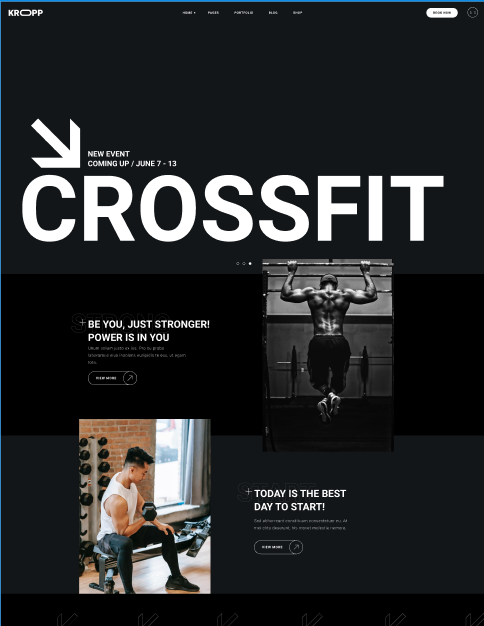
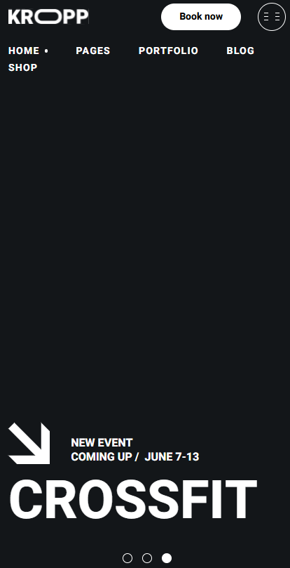

# Kropp Fitness | Responsive landing page layout

## About the Project

The project is built using modern technologies: HTML, CSS, semantic tags, CSS Grid, Flexbox, and BEM methodology.

- **Semantic HTML**: Tags like `<header>`, `<table>`, `<section>`,`<footer>`, and others were used to improve accessibility and structure.
- **Responsive Design**: The page displays correctly on devices with different screen sizes.
- **Local Fonts**: Fonts are loaded locally in WOFF2 format for better performance.
- **Pure CSS**: Flexbox, CSS Grid, and CSS variables.
- **BEM**: Class naming methodology for improved code readability and maintainability.

## Screenshot




## Links

- [GitHub Repository](https://github.com/Khudatbegow/kropp-fitness)

## Technologies:

- **HTML5**
- **CSS3**
- **Fonts**
- **Responsiveness**
- **Grid / Flexbox**
- **BEM**

## Features

- **Semantic Markup**: Proper use of tags to improve accessibility and SEO.
- **Font Optimization**: Local fonts in WOFF2 format for faster loading.
- **Responsive Design**: The page adapts to different devices, from mobile to desktop.

## How to Run the Project

1. Clone the repository:

```bash
git clone https://github.com/Khudatbegow/kropp-fitness.git
```

2. Open the index.html file in your browser.

## Feedback

If you have any suggestions or feedback, please feel free to reach out:

- **GitHub**: [Khudatbegow](https://github.com/Khudatbegow)
- **Telegram**: [@khudatbegow](https://t.me/khudatbegow)
